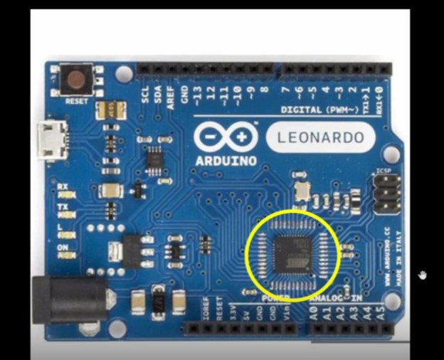

Introduction

In today’s era, everyone has heard the word chip. Somewhere in the news or on social media.
The electronics world works on these small chips. To find a chip you need to find a PCB board, which can be found easily around you. For example, Tv, Computer, A.C., Smartphones, and the list goes on. Or simply you can refer to the following image which shows a PCB board Arduino
 

The yellow circled mark is an Integrated circuit. The chip is inside that package. 

 
The Size of the package is 7x7 mm. It consists of 48 pins. The package type is QFN (Quad Flat No-leads).
There are different packages available such as BGA, SOIC, LGA, QFP, etc. But for our project, we are going to discuss the QFN package. 
 
The chip is inside the package. It is connected with the outside world with the help of pads. The pads are the 48pins which are seen in the above figure.
 
A chip consists of a Die, core area, Pads, IPs, Macros, and std cells.
So the question arises why do we need chips? 
Chips do all the computation work and make our lives easy.
Let's take an example of a stopwatch.  
 
The Application or software is written in some language such as C, C++, or Java (human language/ coding language).
The OS (System Software) with the help of a compiler converts those coding statements into Instruction sets which are again converted to Machine language (Binary numbers 0’s or 1’s) with the help of an assembler. 
The Hardware(chip) will understand the program and will produce the output.

 The figure shows the RTL to GDSII Flow,

1.	Synthesis: Converts RTL to a circuit out of components from the standard cell library (SCL)
2.	Floor Planning: Partition the chip die between different system building blocks and place the I/O pads, defining pin locations, macro placements, and power planning by placing Power rings, power straps and power pads.
3.	Placement: Place the cells on the rows and align with the sites by using global and detailed method.
4.	CTS(Clock Tree Synthesis): Create a clock distribution network to deliver the clock to all sequential elements. It is done by using different types of Tree such as H, X, Fishbone etc.
5.	Route: Implement the interconnect using the available metal layers by using global routing(Which generates routing guides) and detailed routing(Uses the routing guide and implements the actual wires).
6.	Sign Off: In this step, we will do physical verification which includes DRC(Design Rule Check), LVS(Layout Vs Schematic), and timing verification which includes STA(Static Timing Analysis)

 

By using docker and flow.tcl the open lane tool is opened.
 
Once the openLane is opened we need to load all the package everytime. By using command package require openlane 0.9
After that we need to do design setup by providing all the input files. By using command prep -design picorv32a.
 
These are the commands we used in Day1 to understand the tool and get the basic Idea.
