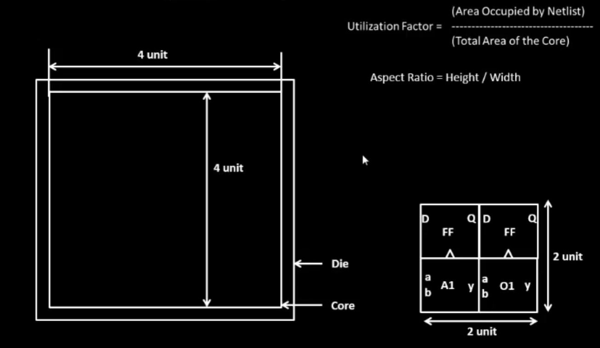

# nasscom-vsd

Digital VLSI SoC Design and Planning

It consists of Five day activities done by me. And later the labs 

The activities includes as follow:

Day 1 - Inception of open-source EDA, OpenLANE and Sky130 PDK.

## Day 2 - Good floorplan vs bad floorplan and introduction to library cells.  
For floorplannning utilization factor needs to be checked. The formula for utilization factor and aspect ratio is given in below image.

Day 3 - Design library cell using Magic Layout and ngspice characterization.

Day 4 - Pre-layout timing analysis and importance of good clock tree.

Day 5 - Final steps for RTL2GDS using tritonRoute and openSTA.
